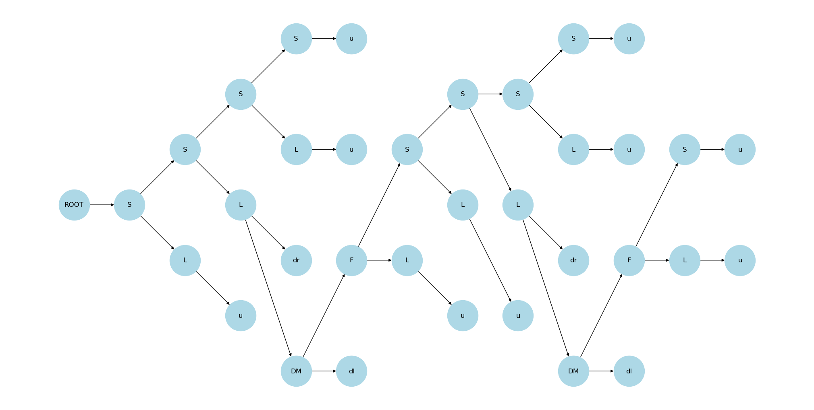

---

# Comparison Between CYK and Earley Parsing Algorithms

## Overview

This project compares the performance and behavior of the CYK (Cocke-Younger-Kasami) algorithm and the Earley parsing algorithm using a probabilistic context-free grammar (PCFG). The CYK parser operates on Chomsky normal form (CNF) grammars, while the Earley parser can handle general grammars, making it more flexible.

The project provides implementations of both algorithms and a test script to benchmark parsing time and visualize the parse tree of a given sentence.

## Core Functionalities

- **CYK Parser**: The grammar used by the CYK parser must be converted to Chomsky Normal Form (CNF), where each rule has one of the following forms:

  `A -> B C (non-terminals only)`

  `A -> a (a single terminal)`

- **Earley Parser**: Suitable for general grammars that include both terminal and non-terminal rules.
- **Grammar Loading**: The code can read grammar definitions from JSON and CNF/PCNF files.
- **JSON Grammar Format**: The `grammar.json` file distinguishes between non-terminals and terminals. Uppercase non-terminals are used for non-terminal containing rules, while lowercase non-terminals indicate terminal containing rules.
- **CNF/PCNF Grammar Format**: The `grammar.cfg` and `grammar.pcnf` files defines the grammar using a standard CNF form (described above).
- **Visualization**: Generates and displays parse trees using `networkx` and `matplotlib`.
- **Performance Benchmarking**: Measures parsing time to compare the efficiency of CYK and Earley algorithms.

## Files

- **`ordered/grammar.json`**: JSON file containing grammar rules and probabilities. 
- **`chomsky/grammar.cnf`**: CFG file for the CYK parser.
- **`chomsky/grammar.pcnf`**: PCFG file containing the probabilities for the CYK parser.
- **`parser_comparison.ipynb`**: Main script for running the comparison and outputting results.

## Explanation of the Code

### CYK Parser

- The CYK parser (`PCNF` class) uses a dynamic programming table to parse the input sentence and compute probabilities based on a given PCFG. It requires the input grammar to be in CNF.

### Earley Parser

- The Earley parser (`Ordered` class) works with general grammars, supporting both terminal and non-terminal rules. It constructs a parse chart to track parsing states and parses the sentence by iteratively filling the chart.

## Benchmark Results
### Test Grammar
```
S -> L S 0.90 | DM dr 0.02 | u 0.08
F -> DM dr 0.65 | L S 0.35
L -> DM dr 0.07 | u 0.93
DM -> dl F 1.0

u -> s 1.0
dl -> d 1.0
dr -> d 1.0
```
- <small> The cnf form of grammar used in Pfold Algorithm</small>
### Test Sentence

The sentence used for comparison is:

```python
sentence = 's d s s d s s d s s d s s'
```

### Parsing Times (10000 times)

- **CYK Parser Time**: `3.2673440000000014 seconds`
- **Earley Parser Time**: `1.9897790000000022 seconds`

### Log Probability and Final Probability

- **Log Probability**: `-15.918356570462597`
- **Probability**: `1.0881929603077809e-07`

### Generated Parse Tree



## Performance Analysis

### Time Metrics

The parsing times reflect the processing duration of each algorithm under controlled test conditions. The times mentioned are CPU times, indicating the actual processing time used by the program, isolating parsing logic performance from other factors.

### Observations

- **CYK Parser**: Effective with CNF grammars but can be slower for complex or long sentences due to quadratic space and time complexity.
- **Earley Parser**: More flexible and faster for general grammars, as shown in the benchmark results.

## Conclusion

The benchmark shows that while the CYK parser is constrained to CNF and may be slower for certain input lengths and structures, the Earley parser provides greater flexibility by supporting general grammars and achieving faster parsing times for this example.

For more information on extending or modifying the code, refer to the code comments and detailed documentation within each Python class.

--- 